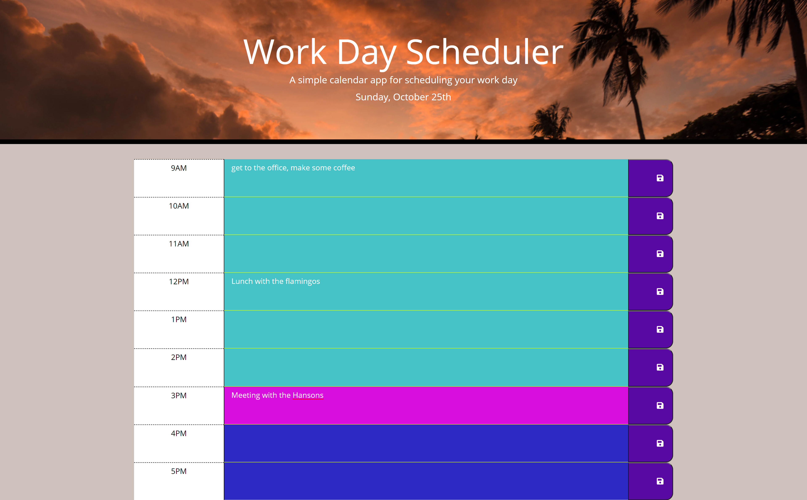

# Daily Schedule Planner

### Objective

Create a functional work day planner that allows users to enter events into hour blocks for a typical work day schedule and save the events so that the events remain persistent when the page is reloaded.

Utilizes: HTML, CSS, JavaScript, Bootstrap, Font-Awesome

[Link to HW 5](https://samfan808.github.io/Daily-schedule-planner/)

Screenshot below:

